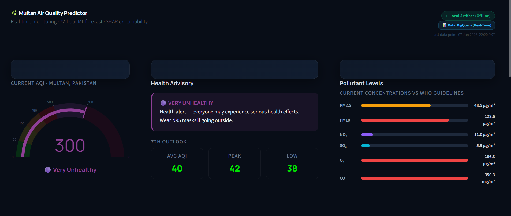
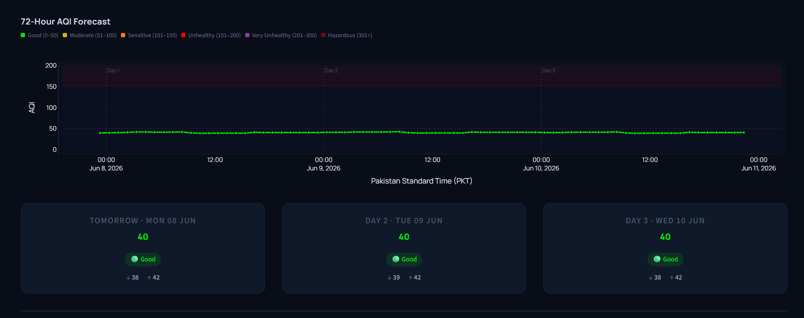
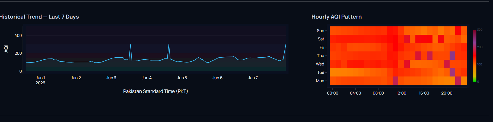
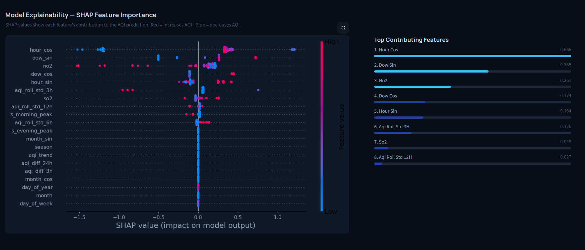

# 🌫️ Multan Air Quality Predictor

> Real-time monitoring · 72-hour ML forecast · SHAP explainability

An automated MLOps pipeline that collects live air pollution data for Multan every hour, computes the EPA Air Quality Index, and forecasts AQI for the next 72 hours — all running on its own through a single GitHub Actions workflow.


---

## 📸 Dashboard Preview

### Live AQI · Health Advisory · Pollutant Levels


### 72-Hour Forecast + 3-Day Summary Cards


### 7-Day Historical Trend + Hourly Heatmap


### SHAP Model Explainability


---

## 📁 Project Structure

```
Aqi_predictor/
│
├── .github/
│   └── workflows/
│       └── mlops-schedule.yml        # Single workflow — runs ingestion + SHAP on schedule
│
├── app/
│   └── main.py                       # Streamlit dashboard entry point
│
├── artifacts/                        # Saved model files (auto-generated, not committed)
│   ├── aqi_best_model.pkl            # Trained XGBoost model
│   ├── aqi_scaler.joblib             # Feature scaler
│   ├── aqi_scaler.pkl                # Feature scaler (backup format)
│   ├── feature_cols.json             # List of 53 feature column names
│   ├── shap_summary_live.png         # Latest SHAP plot (updated daily)
│   └── shap_summary.png              # Saved SHAP summary
│
├── data/
│   └── multan_features.csv           # Engineered features dataset
│
├── src/
│   ├── tests/                        # Unit tests
│   ├── backfill.py                   # One-time script to load 1 year of historical data
│   ├── data_ingestion.py             # Hourly fetch → compute AQI → save to BigQuery
│   ├── explainability.py             # Daily SHAP value computation
│   ├── model_training.py             # XGBoost training + feature engineering
│   └── notebooks/                   # Exploration notebooks
│
├── .env                              # API keys and GCP config (never commit this)
├── .gitignore
└── requirements.txt
```

---

## ⚙️ How It Works

### 1 — Data Collection (`src/data_ingestion.py`)
Every hour, the pipeline calls the OpenWeatherMap API for Multan's coordinates and fetches six pollutant readings: `PM2.5`, `PM10`, `NO2`, `SO2`, `O3`, and `CO`. The data is saved to Google BigQuery.

### 2 — AQI Calculation
The API returns AQI on a 1–5 scale. The system converts it to the standard **EPA 0–500 scale** using the official formula applied to each pollutant individually:

$$AQI = \frac{(AQI_{Hi} - AQI_{Lo})}{(BP_{Hi} - BP_{Lo})} \times (C - BP_{Lo}) + AQI_{Lo}$$

The highest value across all six pollutants becomes the final AQI.

### 3 — Model Training (`src/model_training.py`)
XGBoost is trained on 8,375 hours of historical data with **53 engineered features** including lag values (1h–72h), rolling averages, cyclical time encodings, and peak hour flags. The trained model is saved to `artifacts/aqi_best_model.pkl`.

| Model | R² | Avg Error |
|-------|----|-----------|
| Linear Regression | 0.812 | 18.4 pts |
| Random Forest | 0.971 | 6.8 pts |
| **XGBoost ✅** | **0.989** | **~3 pts** |

### 4 — Forecasting
The model predicts AQI one hour at a time — each prediction is used as the lag input for the next step — building a full **72-hour recursive forecast**.

### 5 — SHAP Explainability (`src/explainability.py`)
Every midnight, SHAP values are recomputed using `TreeExplainer` and saved as `artifacts/shap_summary_live.png`. Top contributing features from your model:

| Rank | Feature | SHAP Value |
|------|---------|-----------|
| 1 | hour_cos | 0.666 |
| 2 | dow_sin | 0.385 |
| 3 | no2 | 0.261 |
| 4 | dow_cos | 0.174 |
| 5 | hour_sin | 0.164 |

---

## 🤖 Automation (`mlops-schedule.yml`)

A single GitHub Actions workflow handles everything on a cron schedule:

```yaml
# Hourly — data ingestion
- cron: '0 * * * *'
  runs: src/data_ingestion.py

# Daily midnight — SHAP update
- cron: '0 0 * * *'
  runs: src/explainability.py
```

Authentication uses **Workload Identity Federation** — no API keys or service account files stored in the repo.

---

## 📊 Dashboard (`app/main.py`)

Run locally with:
```bash
streamlit run app/main.py
```

The dashboard has four sections:

**Section 1 — Live Overview**
- AQI gauge (0–500 scale, EPA colour-coded: Good → Hazardous)
- Health advisory with specific recommendations (e.g. *"Wear N95 masks if going outside"*)
- 72H outlook summary: Avg / Peak / Low AQI
- Live pollutant bar chart vs WHO limits (PM2.5, PM10, NO₂, SO₂, O₃, CO)

**Section 2 — 72-Hour Forecast**
- Colour-coded line chart (Jun 8–11) with AQI health zone shading
- 3 summary cards: Tomorrow · Day 2 · Day 3 with avg AQI, min/max range, and health category

**Section 3 — Historical & Patterns**
- 7-day AQI line chart (Jun 1–7) pulled live from BigQuery
- Hourly heatmap: day-of-week × hour showing typical pollution patterns across the week

**Section 4 — Model Explainability**
- SHAP beeswarm plot — Red dots = increases AQI, Blue dots = decreases AQI
- Top contributing features ranked by absolute SHAP value

> Status badges in the top-right show whether data is coming from **BigQuery (Real-Time)** or a **Local Artifact (Offline)** fallback.

---

## 🚀 Getting Started

### 1. Clone & Install

```bash
git clone https://github.com/MohsinAzad32/Aqi_predictor.git
cd Aqi_predictor
pip install -r requirements.txt
```

### 2. Set Up `.env`

```env
OWM_API_KEY=your_openweathermap_key
GCP_PROJECT_ID=your_project_id
BQ_DATASET=aqi_data
BQ_TABLE=multan_hourly
GCS_BUCKET=your_bucket_name
```

### 3. Load Historical Data (First Time Only)

```bash
python src/backfill.py
```

### 4. Train the Model

```bash
python src/model_training.py
```

### 5. Run the Dashboard

```bash
streamlit run app/main.py
```

---

## 🔧 Requirements

Key dependencies from `requirements.txt`:

```
streamlit
xgboost
shap
pandas
scikit-learn
google-cloud-bigquery
google-cloud-storage
openmeteo-requests
python-dotenv
